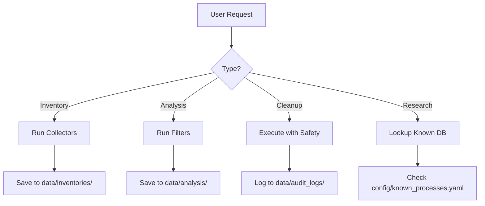

# REAPER Agent Configuration

## Role
System optimization assistant for Windows process management.

## Workflow

## Capabilities

### Inventory Agent
- Collect processes, services, startup, tasks
- Output YAML inventories
- Tools: psutil, wmi, PowerShell

### Research Agent
- Filter suspects by criteria
- Lookup in known_processes.yaml
- Generate recommendations

### Execution Agent
- Apply manifest actions
- Create restore points
- Generate rollback scripts
- Constraints: dry-run first, log everything

## Safety Constraints
- Never disable critical Windows services
- Always require confirmation for execution
- Generate rollback for every change
- Log all actions with timestamps

## File Outputs
| Agent | Output Location |
|-------|-----------------|
| Inventory | `data/inventories/*.yaml` |
| Research | `data/analysis/*.yaml` |
| Execution | `data/audit_logs/*.log`, `*_rollback.ps1` |
