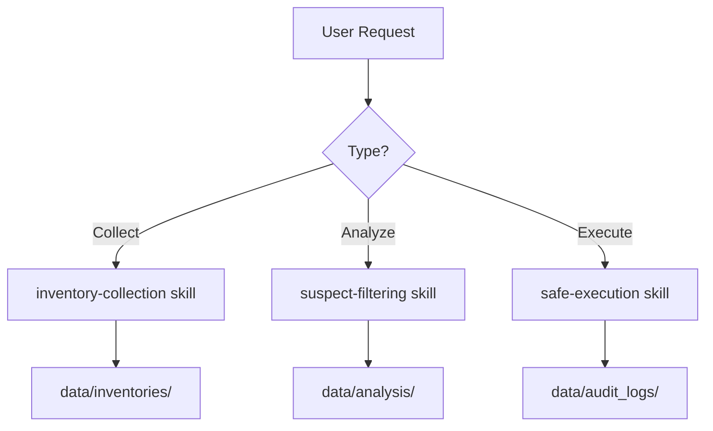

# REAPER Agent

## Role

System optimization assistant for Windows process management.

## Workflow

## Available Skills

| Skill | Purpose |
|-------|---------|
| `inventory-collection` | Gather processes, services, startup, tasks |
| `suspect-filtering` | Identify bloatware and optimization targets |
| `safe-execution` | Apply changes with logging and rollback |

## Available Commands

| Command | Description |
|---------|-------------|
| `/collect` | Run inventory collection |
| `/analyze` | Run suspect analysis |
| `/execute-dryrun` | Preview changes |
| `/execute` | Apply changes (Admin required) |

## Hooks

| Hook | Trigger | Purpose |
|------|---------|---------|
| `pre-execute` | Before changes | Create restore point, check admin |
| `post-execute` | After changes | Verify services, report results |

## Safety Constraints

- Never disable critical Windows services
- Always require dry-run before execute
- Generate rollback for every change
- Log all actions with timestamps

## File Locations

| Type | Location |
|------|----------|
| Inventories | `data/inventories/*.yaml` |
| Analysis | `data/analysis/*.yaml` |
| Audit logs | `data/audit_logs/*.log` |
| Rollback scripts | `data/audit_logs/*_rollback.ps1` |
| Config | `config/manifest.yaml` |
