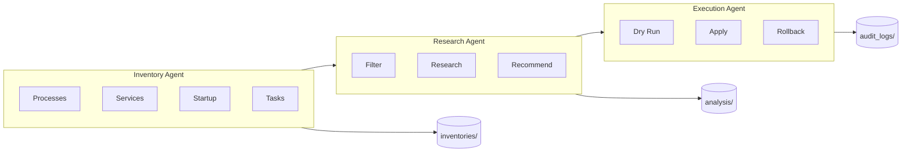

# REAPER Agents

**R**esource **E**valuation, **A**nalysis, **P**rocess **E**limination & **R**eporting

## Overview



---

## Inventory Agent

**Purpose**: Collect system state

**Tools**: psutil, wmi, PowerShell

**Output**: `data/inventories/YYYY-MM-DD_HH-MM-SS_*.yaml`

```bash
python scripts/collect_inventory.py
```

---

## Research Agent

**Purpose**: Identify suspects, document findings

**Suspect Criteria**:
- Non-Microsoft signature
- High resource usage
- Matches bloatware patterns
- AI processes (Copilot, Recall)

**Output**: `data/analysis/*.yaml`

```bash
python scripts/analyze_suspects.py
```

---

## Execution Agent

**Purpose**: Apply changes safely

**Constraints**:
- Must dry-run first
- Must log all changes
- Must generate rollback
- Never touch critical_keep_list

**Output**: `data/audit_logs/*_execution.log`, `*_rollback.ps1`

```powershell
.\scripts\execute_cleanup.ps1 -DryRun
.\scripts\execute_cleanup.ps1 -Execute
```

---

## Protection Agent

**Purpose**: Re-apply after Windows updates

```powershell
.\scripts\post_update_check.ps1 -AutoReapply
```
