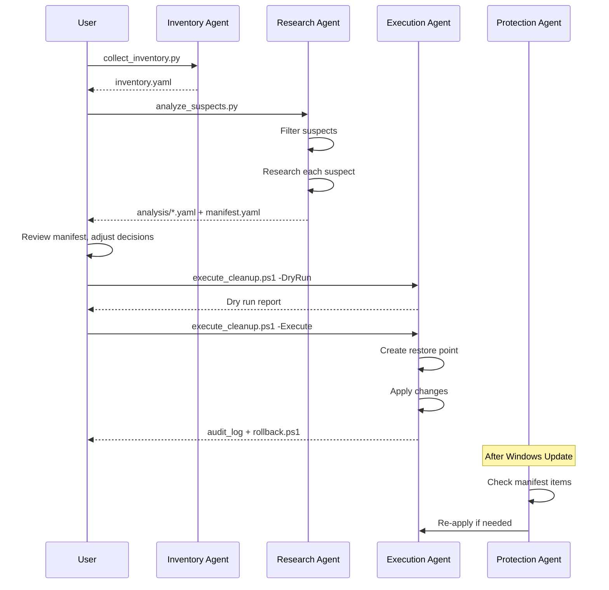

# REAPER Agents

**R**esource **E**valuation, **A**nalysis, **P**rocess **E**limination & **R**eporting

This document defines the AI agents and workflows used in REAPER.

## Overview

REAPER uses a multi-agent approach where each agent has specific responsibilities:

```
┌─────────────────┐    ┌─────────────────┐    ┌─────────────────┐
│ Inventory Agent │───▶│ Research Agent  │───▶│ Execution Agent │
└─────────────────┘    └─────────────────┘    └─────────────────┘
        │                      │                      │
        ▼                      ▼                      ▼
   inventories/           analysis/             audit_logs/
```

---

## Inventory Agent

**Purpose**: Collect comprehensive system state information

### Capabilities
- Collect running processes with resource usage
- Enumerate Windows services and their states
- Find all startup items (registry, folders, scheduled tasks)
- Detect installed applications (AppX packages, Win32 apps)

### Tools
- `psutil` - Process and system information
- `wmi` - Windows Management Instrumentation queries
- PowerShell cmdlets - `Get-Service`, `Get-ScheduledTask`, `Get-AppxPackage`

### Outputs
- `data/inventories/YYYY-MM-DD_HH-MM-SS_inventory.yaml`

### Invocation
```bash
python scripts/collect_inventory.py
```

---

## Research Agent

**Purpose**: Analyze suspect processes and document findings

### Capabilities
- Filter inventory to identify "suspect" items
- Search knowledge base for known process information
- Web search for official documentation when needed
- Generate recommendations: KEEP, DISABLE, REMOVE
- Document reasoning and rollback steps

### Suspect Criteria
- Non-Microsoft digital signature
- High resource usage (top 20% CPU/RAM)
- Matches known bloatware patterns
- AI-related processes (Copilot, Recall, etc.)
- Services set to Auto that aren't Microsoft core

### Tools
- Local knowledge base (`config/known_processes.yaml`)
- Web search for documentation
- Pattern matching against bloatware signatures

### Outputs
- `data/analysis/{process_name}.yaml` - Per-process research
- Updates to `config/manifest.yaml` - Recommendations

### Invocation
```bash
python scripts/analyze_suspects.py [--inventory-file PATH]
```

---

## Execution Agent

**Purpose**: Safely apply changes with full auditability

### Capabilities
- Disable/enable Windows services
- Remove startup registry entries
- Uninstall AppX packages
- Apply registry tweaks (Copilot, telemetry, etc.)
- Create system restore points
- Generate rollback scripts

### Constraints
- **MUST** run dry-run first before any changes
- **MUST** log all changes with before/after state
- **MUST** generate rollback commands for each change
- **MUST** create system restore point before execution
- **NEVER** disable items on the known-safe list

### Tools
- PowerShell (elevated) - All system modifications
- `Checkpoint-Computer` - Restore points
- Registry manipulation via `reg.exe` or PowerShell

### Outputs
- `data/audit_logs/YYYY-MM-DD_HH-MM-SS_execution.log`
- `data/audit_logs/YYYY-MM-DD_HH-MM-SS_rollback.ps1`

### Invocation
```powershell
# Dry run (no changes, shows what would happen)
.\scripts\execute_cleanup.ps1 -DryRun

# Execute for real
.\scripts\execute_cleanup.ps1 -Execute
```

---

## Protection Agent

**Purpose**: Maintain optimizations after Windows updates

### Capabilities
- Monitor for Windows update completion
- Re-check manifest items against current state
- Re-apply any settings that were reverted
- Log items that Windows restored

### Scheduled Execution
- Runs as Windows Scheduled Task
- Triggered after Windows Update completion
- Can also be run manually

### Outputs
- `data/audit_logs/protection_YYYY-MM-DD.log`

### Invocation
```powershell
.\scripts\post_update_check.ps1
```

---

## Workflow: Full System Cleanup



---

## Skills Reference

### Skill: Collect Process Information
```python
# Uses psutil to gather process details
import psutil
for proc in psutil.process_iter(['pid', 'name', 'exe', 'cmdline', 'cpu_percent', 'memory_info']):
    # Collect and categorize
```

### Skill: Identify Microsoft-Signed Binaries
```powershell
# Check digital signature
Get-AuthenticodeSignature -FilePath $exePath | 
    Where-Object { $_.SignerCertificate.Subject -like "*Microsoft*" }
```

### Skill: Disable Service Safely
```powershell
# With logging and rollback generation
$service = Get-Service -Name $serviceName
$beforeState = $service.StartType
Set-Service -Name $serviceName -StartupType Disabled
Stop-Service -Name $serviceName -Force
# Log: "ROLLBACK: Set-Service -Name $serviceName -StartupType $beforeState"
```

### Skill: Remove AppX Package
```powershell
# Remove for current user and prevent reinstall
Get-AppxPackage -Name $packageName | Remove-AppxPackage
Get-AppxProvisionedPackage -Online | 
    Where-Object { $_.PackageName -like "*$packageName*" } | 
    Remove-AppxProvisionedPackage -Online
```

### Skill: Apply Registry Tweak
```powershell
# With backup
$regPath = "HKCU:\Software\Policies\Microsoft\Windows\WindowsCopilot"
# Export current state
reg export $regPath "backup_$(Get-Date -Format 'yyyyMMdd').reg"
# Apply change
New-ItemProperty -Path $regPath -Name "TurnOffWindowsCopilot" -Value 1 -PropertyType DWord -Force
```
