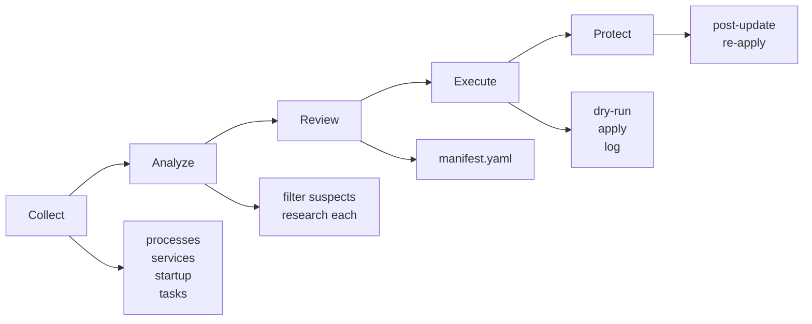
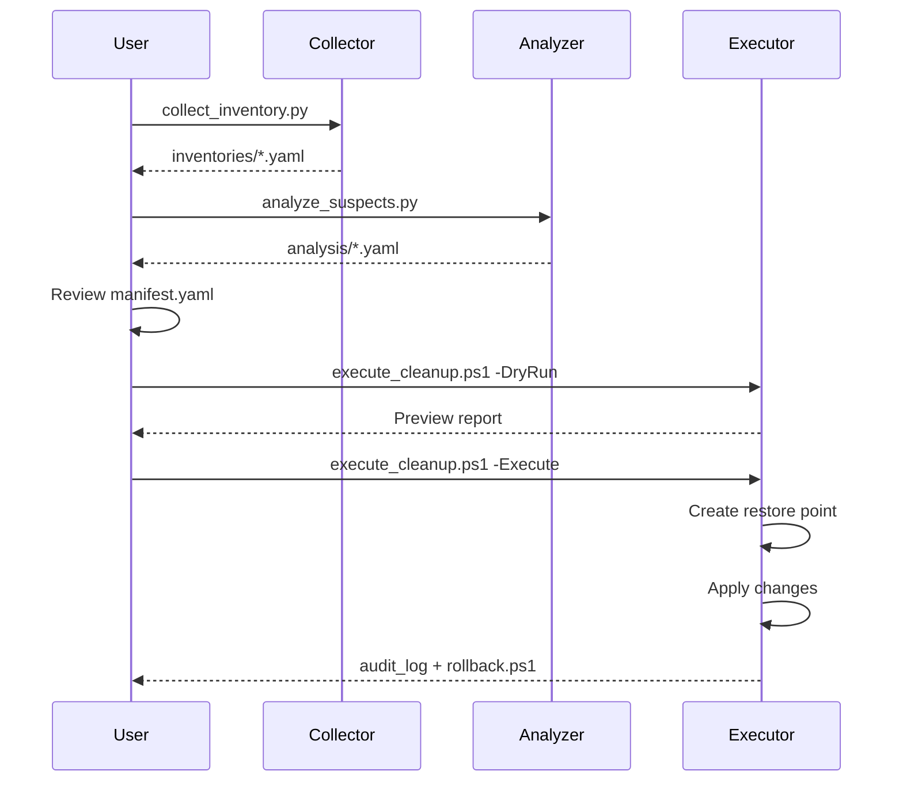

# REAPER

**R**esource **E**valuation, **A**nalysis, **P**rocess **E**limination & **R**eporting

A Windows process investigation and removal toolkit. Inventories your system, identifies bloat, and removes it with rollback capability.

## What It Does



## Quick Start

```powershell
pip install -r requirements.txt

# Collect system state
python scripts/collect_inventory.py

# Find suspects
python scripts/analyze_suspects.py

# Preview changes
.\scripts\execute_cleanup.ps1 -DryRun

# Apply (as Admin)
.\scripts\execute_cleanup.ps1 -Execute
```

## Structure

```
reaper/
├── config/
│   ├── manifest.yaml         # What to keep/remove
│   ├── known_processes.yaml  # Pre-researched database
│   └── settings.yaml         # Thresholds and patterns
├── scripts/
│   ├── collect_inventory.py  # Phase 1
│   ├── analyze_suspects.py   # Phase 2
│   ├── execute_cleanup.ps1   # Phase 3
│   └── post_update_check.ps1 # Phase 4
├── src/
│   ├── collectors/           # Data gathering
│   ├── analyzers/            # Suspect identification
│   └── utils/                # Logging, backup
└── data/
    ├── inventories/          # Raw snapshots
    ├── analysis/             # Research results
    └── audit_logs/           # Execution logs + rollback scripts
```

## Levels

| Level | Targets |
|-------|---------|
| `light` | Telemetry, ads, RGB software |
| `moderate` | + Copilot, Cortana, bloatware apps |
| `aggressive` | + Weather, News, Teams, more services |

```powershell
.\scripts\execute_cleanup.ps1 -Execute -Level moderate
```

## How It Works



## Safety

- Dry-run required before execute
- System restore point created automatically
- Every change logged with rollback command
- Critical processes never touched (40+ in keep list)

## Config

`config/settings.yaml`:
```yaml
suspect_filter:
  high_memory_threshold_percent: 2.0
  high_cpu_threshold_percent: 5.0
  bloatware_patterns:
    - "(?i)chroma"
    - "(?i)copilot"
    - "(?i)cortana"
```

## Requirements

- Windows 10/11
- Python 3.10+
- PowerShell 5.1+ (Admin for changes)

## License

MIT
