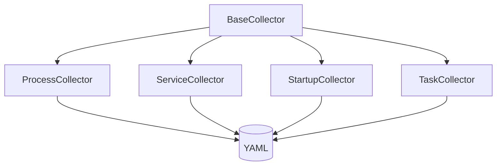
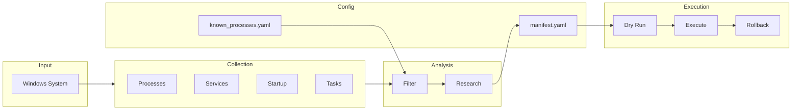

# REAPER Code Review Plan

Systematic review of the codebase: file-level → directory-level → system-level.

---

## Phase 1: File-Level Review

### src/collectors/

- [ ] `base_collector.py`
  - Abstract base class correctness
  - YAML output format consistency
  - Error handling in save()

- [ ] `process_collector.py`
  - psutil iteration safety
  - Signature detection accuracy
  - Memory/CPU measurement reliability
  - Handle AccessDenied gracefully

- [ ] `service_collector.py`
  - WMI query robustness
  - Fallback to sc.exe working
  - Microsoft detection heuristics

- [ ] `startup_collector.py`
  - Registry key coverage complete
  - StartupApproved parsing correct
  - Folder enumeration safe

- [ ] `task_collector.py`
  - PowerShell timeout handling
  - JSON parsing robustness
  - Logon trigger detection

### src/analyzers/

- [ ] `suspect_filter.py`
  - Pattern compilation safety
  - Critical keep list loading
  - Filter logic for each type
  - No false positives on system processes

- [ ] `ai_researcher.py`
  - Known process lookup accuracy
  - Category guessing logic
  - Research notes generation

### src/utils/

- [ ] `logger.py`
  - Log file creation
  - Rollback script generation
  - Thread safety (if needed)

- [ ] `backup.py`
  - Restore point creation works
  - Registry backup exports correctly
  - Error handling on permission denied

### scripts/

- [ ] `collect_inventory.py`
  - CLI argument handling
  - Output directory creation
  - Error reporting

- [ ] `analyze_suspects.py`
  - Inventory file discovery
  - Summary accuracy
  - Recommendations output

- [ ] `execute_cleanup.ps1`
  - DryRun vs Execute separation
  - Restore point creation
  - Rollback script completeness
  - All action types implemented

- [ ] `post_update_check.ps1`
  - Registry checks accurate
  - Service state detection
  - Auto-reapply working

- [ ] `install_protection_task.ps1`
  - Task registration correct
  - Uninstall working

### config/

- [ ] `manifest.yaml`
  - Schema valid
  - All action types have handlers
  - critical_keep_list complete

- [ ] `known_processes.yaml`
  - Entries accurate
  - Safety ratings correct
  - No critical processes marked REMOVE

- [ ] `settings.yaml`
  - Defaults sensible
  - Patterns compile

---

## Phase 2: Directory-Level Review

### collectors/

- [ ] Consistent interface across collectors
- [ ] Same output format structure
- [ ] Error handling patterns uniform
- [ ] No code duplication

### analyzers/

- [ ] Filter → Researcher pipeline clear
- [ ] Known DB integration consistent
- [ ] Recommendation logic sound

### executors/

- [ ] PowerShell modules loadable
- [ ] Functions exported correctly
- [ ] Error handling consistent

### scripts/

- [ ] Entry points well-defined
- [ ] CLI interfaces consistent
- [ ] Exit codes meaningful

---

## Phase 3: System-Level Review

### Data Flow

- [ ] Data flows correctly through pipeline
- [ ] No data loss between stages
- [ ] Config properly influences each stage

### Safety Architecture

- [ ] Critical keep list enforced everywhere
- [ ] Dry-run actually prevents changes
- [ ] Rollback scripts are valid PowerShell
- [ ] Restore points created successfully
- [ ] Audit log captures all changes

### Error Handling

- [ ] Graceful degradation on permission denied
- [ ] No crashes on malformed data
- [ ] Meaningful error messages
- [ ] Partial failures don't corrupt state

### Performance

- [ ] Collection completes in reasonable time
- [ ] No memory leaks in long runs
- [ ] Large inventories handled

---

## Review Checklist Summary

| Area | Files | Status |
|------|-------|--------|
| collectors/ | 5 | [ ] |
| analyzers/ | 2 | [ ] |
| utils/ | 2 | [ ] |
| scripts/ | 5 | [ ] |
| config/ | 3 | [ ] |
| Directory integration | 4 | [ ] |
| System architecture | 4 | [ ] |

**Total items**: 35+
