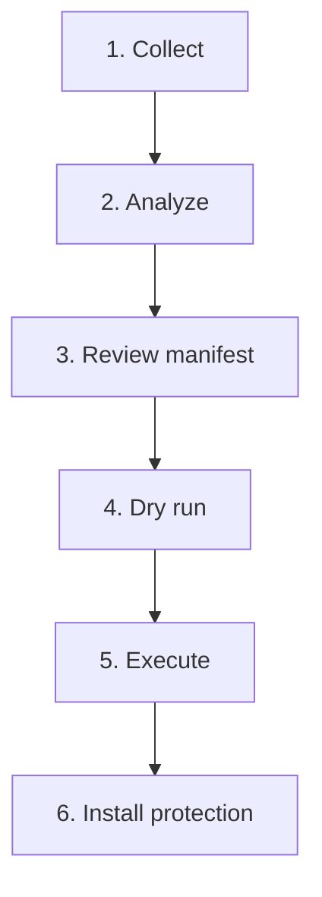

# REAPER Usage

## Install

```powershell
git clone https://github.com/hhalperin/reaper.git
cd reaper
pip install -r requirements.txt
```

## Workflow



### 1. Collect Inventory

```powershell
python scripts/collect_inventory.py
```

Options:
- `--no-signatures` - Skip signature checks (faster)
- `--skip-microsoft-tasks` - Exclude Microsoft scheduled tasks

### 2. Analyze Suspects

```powershell
python scripts/analyze_suspects.py
```

Review output in `data/analysis/analysis_*.yaml`.

### 3. Review Manifest

Edit `config/manifest.yaml` to customize decisions.

### 4. Dry Run

```powershell
.\scripts\execute_cleanup.ps1 -DryRun
```

### 5. Execute (Admin required)

```powershell
.\scripts\execute_cleanup.ps1 -Execute -Level light
```

Levels: `light`, `moderate`, `aggressive`

Profiles (optional):

```powershell
.\scripts\execute_cleanup.ps1 -Execute -Profile gaming_steam
```

Interactive review:

```powershell
.\scripts\execute_cleanup.ps1 -Execute -ConfirmEach
```

Other options:
- `-SkipRegistryBackup` - Skip exporting registry backups
- `-SkipRestorePoint` - Skip restore point creation

### 6. Install Protection

```powershell
.\scripts\install_protection_task.ps1
```

Runs after each logon to re-apply settings Windows might revert.

With a profile:

```powershell
.\scripts\install_protection_task.ps1 -Profile gaming_steam
```

## Diff Reports

Compare the two latest inventory snapshots:

```powershell
python scripts/diff_inventory.py
```

## Rollback

If something breaks:

```powershell
# Use generated rollback script
.\data\audit_logs\{timestamp}_rollback.ps1

# Or use System Restore
# Search "Create a restore point" > System Restore
```

## Files

| Location | Contents |
|----------|----------|
| `data/inventories/` | System snapshots |
| `data/analysis/` | Suspect analysis |
| `data/audit_logs/` | Execution logs, rollback scripts |
| `data/backups/` | Registry backups |
| `data/reports/` | Inventory diffs |
| `config/manifest.yaml` | Keep/remove decisions |
| `config/profiles.json` | Profile presets |
